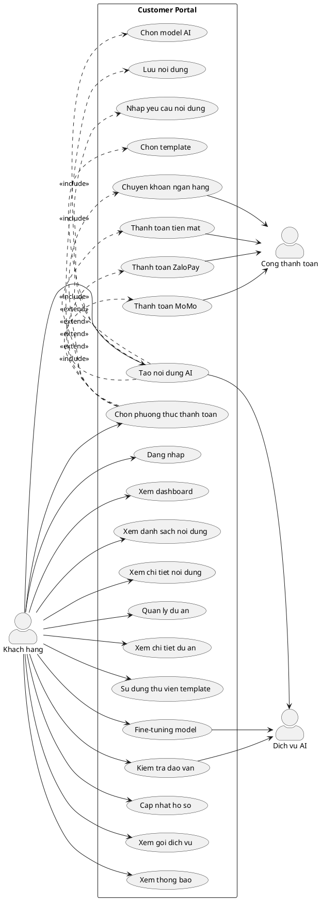
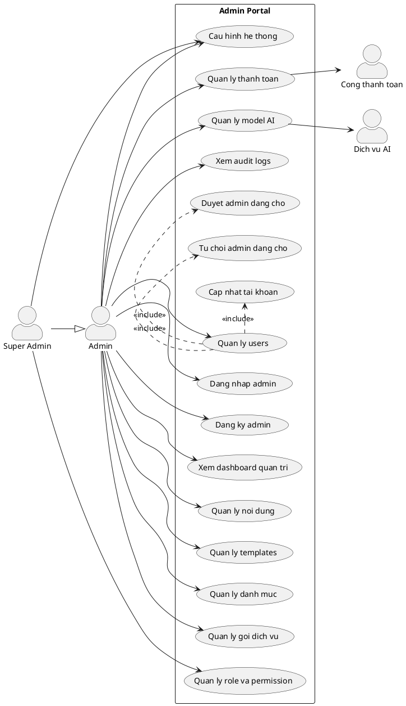

# Use Case Diagram - CopyPro

Tai lieu nay tong hop cac use case chinh cua project CopyPro dua tren route va menu hien co cua frontend.

## Actors

- **Khach truy cap**: nguoi chua dang nhap, co the xem trang cong khai va tao tai khoan.
- **Khach hang**: nguoi dung da dang nhap voi vai tro customer.
- **Admin**: nguoi quan tri he thong, quyen truy cap phu thuoc vao admin role.
- **Cong thanh toan**: dich vu/kenh xu ly thanh toan, gom tien mat, ngan hang, ZaloPay va MoMo.
- **Dich vu AI**: he thong/model AI dung de sinh noi dung, fine-tuning va kiem tra dao van.

## Overall Use Case

```plantuml
@startuml
left to right direction
skinparam packageStyle rectangle
skinparam actorStyle awesome

actor "Khach truy cap" as Guest
actor "Khach hang" as Customer
actor "Admin" as Admin
actor "Cong thanh toan" as PaymentGateway
actor "Dich vu AI" as AIService

rectangle "CopyPro" {
  usecase "Xem trang chu" as UC_Home
  usecase "Xem bang gia" as UC_Pricing
  usecase "Xem gioi thieu" as UC_About
  usecase "Xem blog" as UC_Blog
  usecase "Doc bai viet blog" as UC_BlogDetail
  usecase "Lien he" as UC_Contact
  usecase "Dang ky tai khoan" as UC_Register
  usecase "Dang nhap" as UC_Login
  usecase "Quen mat khau" as UC_Forgot
  usecase "Dat lai mat khau" as UC_Reset

  usecase "Su dung dashboard" as UC_CustomerDashboard
  usecase "Tao noi dung AI" as UC_Generate
  usecase "Quan ly noi dung" as UC_Contents
  usecase "Quan ly du an" as UC_Projects
  usecase "Su dung mau copy" as UC_Templates
  usecase "Fine-tuning" as UC_FineTune
  usecase "Kiem tra dao van" as UC_Plagiarism
  usecase "Quan ly ho so" as UC_Profile
  usecase "Quan ly thanh toan" as UC_Billing
  usecase "Xem thong bao" as UC_Notifications

  usecase "Quan tri he thong" as UC_AdminDashboard
  usecase "Quan ly nguoi dung" as UC_AdminUsers
  usecase "Quan ly noi dung he thong" as UC_AdminContents
  usecase "Quan ly template" as UC_AdminTemplates
  usecase "Quan ly danh muc" as UC_AdminCategories
  usecase "Quan ly goi dich vu" as UC_AdminPlans
  usecase "Quan ly giao dich" as UC_AdminPayments
  usecase "Quan ly model AI" as UC_AdminModels
  usecase "Cau hinh he thong" as UC_AdminSettings
  usecase "Xem audit log" as UC_AdminAudit
  usecase "Quan ly phan quyen" as UC_AdminPermissions
}

Guest --> UC_Home
Guest --> UC_Pricing
Guest --> UC_About
Guest --> UC_Blog
Guest --> UC_BlogDetail
Guest --> UC_Contact
Guest --> UC_Register
Guest --> UC_Login
Guest --> UC_Forgot
Guest --> UC_Reset

Customer --> UC_CustomerDashboard
Customer --> UC_Generate
Customer --> UC_Contents
Customer --> UC_Projects
Customer --> UC_Templates
Customer --> UC_FineTune
Customer --> UC_Plagiarism
Customer --> UC_Profile
Customer --> UC_Billing
Customer --> UC_Notifications

Admin --> UC_AdminDashboard
Admin --> UC_AdminUsers
Admin --> UC_AdminContents
Admin --> UC_AdminTemplates
Admin --> UC_AdminCategories
Admin --> UC_AdminPlans
Admin --> UC_AdminPayments
Admin --> UC_AdminModels
Admin --> UC_AdminSettings
Admin --> UC_AdminAudit
Admin --> UC_AdminPermissions

UC_Billing --> PaymentGateway
UC_AdminPayments --> PaymentGateway
UC_Generate --> AIService
UC_FineTune --> AIService
UC_Plagiarism --> AIService
UC_AdminModels --> AIService
@enduml
```

## Customer Use Case

## Admin Use Case

## Route Mapping

| Actor | Route/Module | Use case |
| --- | --- | --- |
| Khach truy cap | `/`, `/pricing`, `/about`, `/contact` | Xem thong tin cong khai |
| Khach truy cap | `/blog`, `/blog/:slug` | Xem blog va bai viet blog |
| Khach truy cap | `/login`, `/register`, `/forgot-password`, `/reset-password` | Xac thuc tai khoan |
| Khach hang | `/dashboard` | Xem tong quan tai khoan |
| Khach hang | `/generate` | Tao noi dung AI |
| Khach hang | `/contents`, `/contents/:id` | Quan ly va xem chi tiet noi dung |
| Khach hang | `/projects`, `/projects/:id` | Quan ly va xem chi tiet du an |
| Khach hang | `/templates` | Su dung mau copywriting |
| Khach hang | `/fine-tune` | Fine-tuning model |
| Khach hang | `/plagiarism-check` | Kiem tra dao van |
| Khach hang | `/profile` | Quan ly ho so |
| Khach hang | `/billing` | Quan ly goi dich vu va thanh toan |
| Khach hang | `/notifications` | Xem thong bao |
| Admin | `/admin` | Xem dashboard quan tri |
| Admin | `/admin/users` | Quan ly nguoi dung va duyet admin |
| Admin | `/admin/contents` | Quan ly noi dung he thong |
| Admin | `/admin/templates` | Quan ly template |
| Admin | `/admin/categories` | Quan ly danh muc |
| Admin | `/admin/plans` | Quan ly goi dich vu |
| Admin | `/admin/payments` | Quan ly thanh toan |
| Admin | `/admin/models` | Quan ly model AI |
| Admin | `/admin/settings` | Cau hinh he thong |
| Admin | `/admin/audit-logs` | Xem nhat ky quan tri |
| Admin | `/admin/permissions` | Quan ly role va permission |
