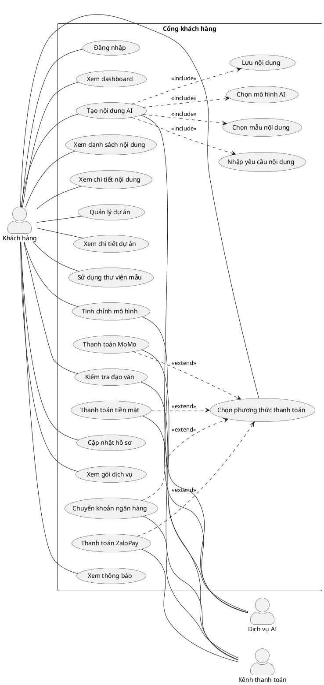
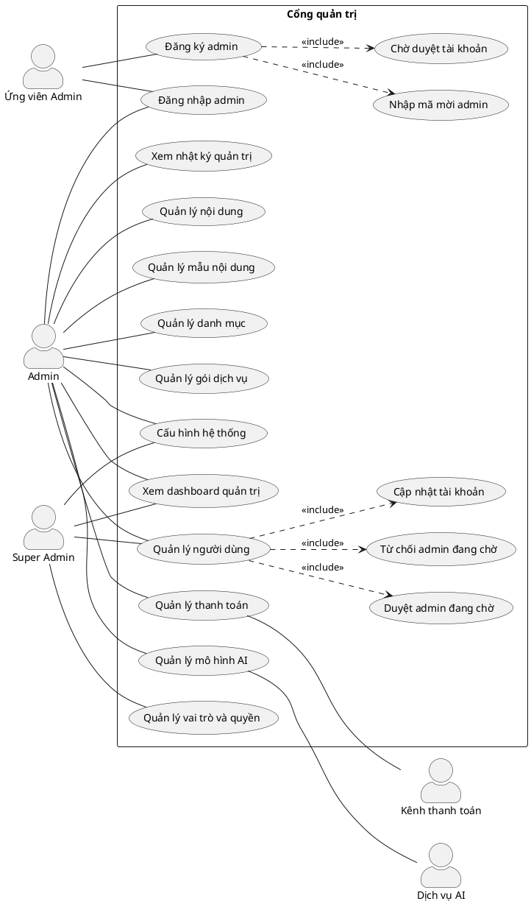

# Use Case Diagram - CopyPro

Tài liệu này tổng hợp các use case chính của project CopyPro dựa trên route và menu hiện có của frontend.

## Actors

- **Khách truy cập**: người chưa đăng nhập, có thể xem các trang công khai và tạo tài khoản khách hàng.
- **Ứng viên Admin**: người đăng ký tài khoản quản trị bằng mã mời và chờ được duyệt.
- **Khách hàng**: người dùng đã đăng nhập với vai trò `customer`.
- **Admin**: người quản trị hệ thống, quyền truy cập phụ thuộc vào vai trò quản trị.
- **Super Admin**: admin có toàn quyền quản lý hệ thống, bao gồm phân quyền.
- **Kênh thanh toán**: các phương thức xử lý thanh toán, gồm tiền mặt, chuyển khoản ngân hàng, ZaloPay và MoMo.
- **Dịch vụ AI**: hệ thống/mô hình AI dùng để sinh nội dung, tinh chỉnh mô hình và kiểm tra đạo văn.

## Sơ đồ tổng quan

```plantuml
@startuml
left to right direction
skinparam packageStyle rectangle
skinparam actorStyle awesome

actor "Khách truy cập" as Guest
actor "Ứng viên Admin" as AdminCandidate
actor "Khách hàng" as Customer
actor "Admin" as Admin
actor "Super Admin" as SuperAdmin
actor "Kênh thanh toán" as PaymentChannel
actor "Dịch vụ AI" as AIService

rectangle "CopyPro" {
  usecase "Xem trang chủ" as UC_Home
  usecase "Xem bảng giá" as UC_Pricing
  usecase "Xem giới thiệu" as UC_About
  usecase "Xem blog" as UC_Blog
  usecase "Đọc bài viết blog" as UC_BlogDetail
  usecase "Liên hệ" as UC_Contact
  usecase "Đăng ký khách hàng" as UC_Register
  usecase "Đăng nhập" as UC_Login
  usecase "Quên mật khẩu" as UC_Forgot
  usecase "Đặt lại mật khẩu" as UC_Reset
  usecase "Đăng ký admin" as UC_AdminRegister
  usecase "Đăng nhập admin" as UC_AdminLogin

  usecase "Xem dashboard khách hàng" as UC_CustomerDashboard
  usecase "Tạo nội dung AI" as UC_Generate
  usecase "Quản lý nội dung" as UC_Contents
  usecase "Quản lý dự án" as UC_Projects
  usecase "Sử dụng mẫu copy" as UC_Templates
  usecase "Tinh chỉnh mô hình" as UC_FineTune
  usecase "Kiểm tra đạo văn" as UC_Plagiarism
  usecase "Quản lý hồ sơ" as UC_Profile
  usecase "Quản lý thanh toán" as UC_Billing
  usecase "Xem thông báo" as UC_Notifications

  usecase "Xem dashboard quản trị" as UC_AdminDashboard
  usecase "Quản lý người dùng" as UC_AdminUsers
  usecase "Quản lý nội dung hệ thống" as UC_AdminContents
  usecase "Quản lý mẫu nội dung" as UC_AdminTemplates
  usecase "Quản lý danh mục" as UC_AdminCategories
  usecase "Quản lý gói dịch vụ" as UC_AdminPlans
  usecase "Quản lý giao dịch" as UC_AdminPayments
  usecase "Quản lý mô hình AI" as UC_AdminModels
  usecase "Cấu hình hệ thống" as UC_AdminSettings
  usecase "Xem nhật ký quản trị" as UC_AdminAudit
  usecase "Quản lý phân quyền" as UC_AdminPermissions
}

Guest -- UC_Home
Guest -- UC_Pricing
Guest -- UC_About
Guest -- UC_Blog
Guest -- UC_BlogDetail
Guest -- UC_Contact
Guest -- UC_Register
Guest -- UC_Login
Guest -- UC_Forgot
Guest -- UC_Reset

AdminCandidate -- UC_AdminRegister
AdminCandidate -- UC_AdminLogin

Customer -- UC_CustomerDashboard
Customer -- UC_Generate
Customer -- UC_Contents
Customer -- UC_Projects
Customer -- UC_Templates
Customer -- UC_FineTune
Customer -- UC_Plagiarism
Customer -- UC_Profile
Customer -- UC_Billing
Customer -- UC_Notifications

Admin -- UC_AdminLogin
Admin -- UC_AdminDashboard
Admin -- UC_AdminUsers
Admin -- UC_AdminContents
Admin -- UC_AdminTemplates
Admin -- UC_AdminCategories
Admin -- UC_AdminPlans
Admin -- UC_AdminPayments
Admin -- UC_AdminModels
Admin -- UC_AdminSettings
Admin -- UC_AdminAudit

SuperAdmin -- UC_AdminDashboard
SuperAdmin -- UC_AdminUsers
SuperAdmin -- UC_AdminSettings
SuperAdmin -- UC_AdminPermissions

UC_Billing -- PaymentChannel
UC_AdminPayments -- PaymentChannel
UC_Generate -- AIService
UC_FineTune -- AIService
UC_Plagiarism -- AIService
UC_AdminModels -- AIService
@enduml
```

## Use Case Khách hàng

## Use Case Admin

## Mapping route và use case

| Actor | Route/Module | Use case |
| --- | --- | --- |
| Khách truy cập | `/`, `/pricing`, `/about`, `/contact` | Xem thông tin công khai |
| Khách truy cập | `/blog`, `/blog/:slug` | Xem blog và bài viết blog |
| Khách truy cập | `/login`, `/register`, `/forgot-password`, `/reset-password` | Xác thực tài khoản khách hàng |
| Ứng viên Admin | `/admin/register` | Đăng ký admin bằng mã mời và chờ duyệt |
| Admin | `/admin/login` | Đăng nhập trang quản trị |
| Khách hàng | `/dashboard` | Xem tổng quan tài khoản |
| Khách hàng | `/generate` | Tạo nội dung AI |
| Khách hàng | `/contents`, `/contents/:id` | Quản lý và xem chi tiết nội dung |
| Khách hàng | `/projects`, `/projects/:id` | Quản lý và xem chi tiết dự án |
| Khách hàng | `/templates` | Sử dụng mẫu copywriting |
| Khách hàng | `/fine-tune` | Tinh chỉnh mô hình |
| Khách hàng | `/plagiarism-check` | Kiểm tra đạo văn |
| Khách hàng | `/profile` | Quản lý hồ sơ |
| Khách hàng | `/billing` | Quản lý gói dịch vụ và thanh toán |
| Khách hàng | `/notifications` | Xem thông báo |
| Admin | `/admin` | Xem dashboard quản trị |
| Admin | `/admin/users` | Quản lý người dùng và duyệt admin |
| Admin | `/admin/contents` | Quản lý nội dung hệ thống |
| Admin | `/admin/templates` | Quản lý mẫu nội dung |
| Admin | `/admin/categories` | Quản lý danh mục |
| Admin | `/admin/plans` | Quản lý gói dịch vụ |
| Admin | `/admin/payments` | Quản lý thanh toán |
| Admin | `/admin/models` | Quản lý mô hình AI |
| Admin | `/admin/settings` | Cấu hình hệ thống |
| Admin | `/admin/audit-logs` | Xem nhật ký quản trị |
| Super Admin | `/admin/permissions` | Quản lý vai trò và quyền |
